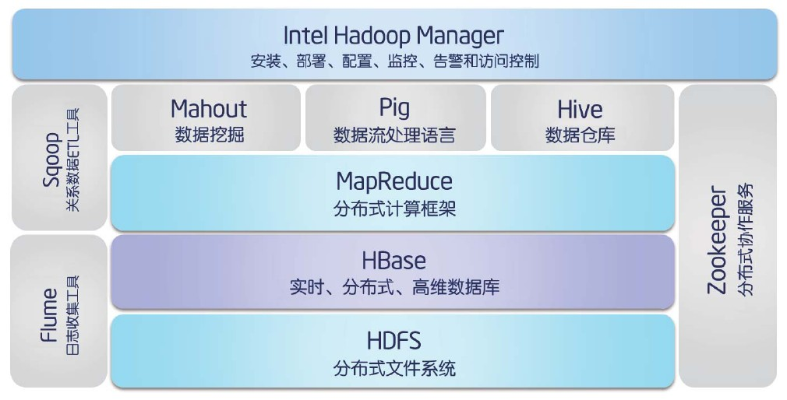
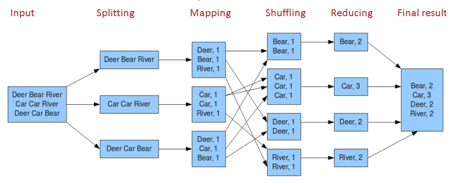
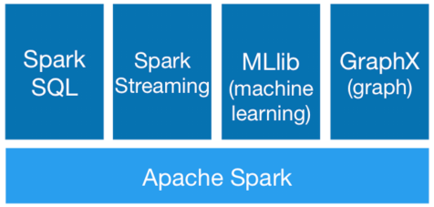
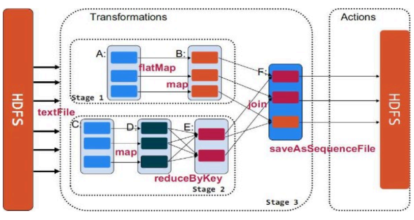

# 进程与线程

**进程**：程序的一次执行（程序装载入内存，系统分配资源运行）。
每个进程有自己的内存空间、数据栈等，只能使用进程间通讯，而不能直接共享信息。

**线程**：所有线程运行在同一个进程中，共享相同的运行环境。
每个独立的线程有一个程序运行的入口、顺序执行序列和程序的出口。
线程的运行可以被抢占（中断），或暂时被挂起（睡眠），让其他线程运行（让步）。
一个进程中的各个线程间共享同一片数据空间。

# 全局解释器锁GIL

GIL全称全局解释器锁Global Interpreter Lock， GIL 并不是Python的特性，它是在实现Python解析器(CPython)时所引入的一个概念。

GIL是一把全局排他锁，同一时刻只有一个线程在运行。
毫无疑问全局锁的存在会对多线程的效率有不小影响。甚至就几乎等于Python是个单线程的程序。

multiprocessing库的出现很大程度上是为了弥补thread库，因为GIL而低效的缺陷。它完整的复制了一套thread所提供的接口方便迁移。唯一的不同就是它使用了多进程而不是多线程。每个进程有自己的独立的GIL，因此也不会出现进程之间的GIL争抢。

# 顺序执行单线程与同时执行两个并发线程

join阻塞进程直到线程执行完毕


```python
"""
顺序执行单线程与同时执行两个并发线程
"""
from threading import Thread
import time


def my_counter():
    i = 0
    for _ in range(10000000):
        i = i + 1
    return True


# 顺序执行
def main():
    thread_array = {}
    start_time = time.time()
    for tid in range(2):
        t = Thread(target=my_counter())
        t.start()
        t.join()  # 阻塞进程直到线程执行完毕
    end_time = time.time()
    print("Total time: {}".format(end_time - start_time))


# 并发执行
def main2():
    thread_array = {}
    start_time = time.time()
    for tid in range(2):
        t = Thread(target=my_counter())
        t.start()
        thread_array[tid] = t
    for i in range(2):
        thread_array[i].join()
    end_time = time.time()
    print("Total time: {}".format(end_time - start_time))

```


```python
main()
```


```python
main2()
```

# Python 多进程（ multiprocessing）

**fork操作**：

调用一次，返回两次。因为操作系统自动把当前进程（称为父进程）复制了一份（称为子进程）， 然后分别在父进程和子进程内返回。子进程永远返回0，而父进程返回子进程的ID。子进程只需要调用getppid()就可以拿到父进程的ID。

由于Windows没有fork调用，下面的代码在Windows上无法运行。


```python
import os

if __name__ == '__main__':
    print('Process (%s) start...' % os.getpid())
    pid = os.fork()
    print(pid)
    if pid == 0:
        print('I am child process (%s) and my parent is %s.' % (os.getpid(), os.getppid()))
    else:
        print('I (%s) just created a child process (%s).' % (os.getpid(), pid))

```

multiprocessing是跨平台版本的多进程模块，它提供了一个Process类来代表一个进程对象，下面是示例代码:


```python
from multiprocessing import Process
import time


def f(n):
    time.sleep(1)
    print(n * n)


if __name__ == '__main__':
    for i in range(10):
        p = Process(target=f, args=[i, ])
        p.start()

```

这个程序如果用单进程写则需要执行10秒以上的时间，而用多进程则启动10个进程并行执行，只需要用1秒多的时间。

# 进程间通信Queue

Queue是多进程安全的队列，可以使用Queue实现多进程之间的数据传递。


```python
"""
进程间通信Queue
"""
from multiprocessing import Process, Queue
import time


def write(q):
    for i in list('ABCDE'):
        print('Put %s to queue' % i)
        q.put(i)
        time.sleep(0.5)


def read(q):
    while True:
        v = q.get(True)
        print('Get %s from queue' % v)


if __name__ == '__main__':
    q = Queue()
    pw = Process(target=write, args=(q,))
    pr = Process(target=read, args=(q,))
    pw.start()
    pr.start()
    pr.join()
    pr.terminate()
    pw.terminate()

```

# 进程池Pool

用于批量创建子进程，可以灵活控制子进程的数量


```python
"""
进程池Pool
用于批量子创建进程，可以灵活控制子进程的数量
"""
from multiprocessing import Pool
import time


def f(x):
    x = x * x
    print(x)
    time.sleep(2)
    return x


if __name__ == '__main__':
    # 定义启动的进程数量
    pool = Pool(processes=5)
    res_list = []
    for i in range(10):
        # 以异步并行的方式启动进程，如果要同步等待的方式，
        # 可以在每次启动进程之后调用res.get()方法，也可以使用Pool.apply
        res = pool.apply_async(f, [i, ])
        print('--------:', i)
        res_list.append(res)
    pool.close()
    pool.join()
    for r in res_list:
        print('result', (r.get(timeout=5)))

```

# 多进程与多线程对比

在一般情况下多个进程的内存资源是相互独立的，而多线程可以共享同一个进程中的内存资源


```python
from multiprocessing import Process
import threading
import time

lock = threading.Lock()


def run(info_list, n):
    lock.acquire()
    info_list.append(n)
    lock.release()
    print('%s\n' % info_list)


if __name__ == '__main__':
    info = []
    for i in range(10):
        # target为子进程执行的函数，args为需要给函数传递的参数
        p = Process(target=run, args=[info, i])
        p.start()
        p.join()
    time.sleep(1)  # 这里是为了输出整齐让主进程的执行等一下子进程
    print('------------threading--------------')
    for i in range(10):
        p = threading.Thread(target=run, args=[info, i])
        p.start()
        p.join()

```

# 函数式编程

## 三大特性：

immutable data 不可变数据

first class functions：函数像变量一样使用

尾递归优化：每次递归都重用stack

## 好处：

parallelization 并行

lazy evaluation 惰性求值

determinism 确定性


```python
def inc(x):
    def incx(y):
        return x + y

    return incx


inc2 = inc(2)
inc5 = inc(5)

print(inc2(5))  # 输出 7
print(inc5(5))  # 输出 10

```

**lambda**:快速定义单行的最小函数， inline的匿名函数


```python
g = lambda x: x * 2
print(g(3))
print((lambda x: x * 2)(4))
```

**map(function, sequence)**：对sequence中的item依次执行function(item)，执行结果组成一个List返回


```python
# 一般写法
for n in ["qi", "yue", "July"]:
    print(len(n))
```


```python
# map写法
name_len = map(len, ["qi", "yue", "July"])
print(list(name_len))
```


```python
# map写法
def toUpper(item):
    return item.upper()

upper_name = map(toUpper, ["qi", "yue", "July"])
print(list(upper_name))
```


```python
# 一般写法
items = [1, 2, 3, 4, 5]
squared = []
for i in items:
    squared.append(i ** 2)
print(squared)
```


```python
# map写法
items = [1, 2, 3, 4, 5]
squared = list(map(lambda x: x ** 2, items))
print(squared)
```

**filter(function, sequence)**：对sequence中的item依次执行function(item)，将执行结果为True的item组成一个List/String/Tuple（取决于sequence的类型）返回


```python
number_list = range(-5, 5)
less_than_zero = list(filter(lambda x: x < 0, number_list))
print(less_than_zero)
```

**reduce(function, sequence, starting_value)**：对sequence中的item顺序迭代调用function，如果有starting_value，还可以作为初始值调用


```python
from functools import reduce


def add(x, y): return x + y

# 无初始值
print(reduce(add, range(1, 5)))
# 初始值为10
print(reduce(add, range(1, 5), 10))

```

例子：计算数组中正数的平均数


```python
# 正常写法：
num = [2, -5, 9, 7, -2, 5, 3, 1, 0, -3, 8]
positive_num_cnt = 0
positive_num_sum = 0
for i in range(len(num)):
    if num[i] > 0:
        positive_num_cnt += 1
        positive_num_sum += num[i]

if positive_num_cnt > 0:
    average = positive_num_sum / positive_num_cnt

print(average)  # 输出 5

```


```python
# 函数式写法：
from functools import reduce

num = [2, -5, 9, 7, -2, 5, 3, 1, 0, -3, 8]
positive_num = list(filter(lambda x: x > 0, num))
average = (reduce(lambda x, y: x + y, positive_num)) / len(positive_num)
print(average)

```

# Hadoop

Hadoop是Apache开源组织的一个分布式计算开源框架。

核心的设计就是： MapReduce和HDFS（Hadoop Distributed File System）



## MapReducer

思想：任务的分解与结果的汇总

下图展示了如何通过MapReduce的思想汇总单词数量



## 基于Linux管道的MapReducer


```python
# mapper.py
import sys

for line in sys.stdin:
    ls = line.split()
    for word in ls:
        if len(word.strip()) != 0:
            print(word + ',' + str(1))

```


```python
# mapper.py
import sys

word_dict = {}
for line in sys.stdin:
    ls = line.split(',')
    word_dict.setdefault(ls[0], 0)
    word_dict[ls[0]] += int(ls[1])

for word in word_dict:
    print(word, word_dict[word])

```

wordcount.input 文件内容


```python
hello
world
hello world
hi world
```

在Linux 命令行中执行下面语句，把文件wordcount.input的内容通过mapper和reducer处理后按照第二列倒序排列输出


```python
$ cat wordcount.input | python mapper.py | python reducer.py | sort -k 2r
```

输出结果：

world 3

hello 2

hi 1

## Hadoop Streaming & mrjob

Hadoop有Java和Streaming两种方式来编写MapReduce任务。

Java的优点是计算效率高，并且部署方便，直接打包成一个jar文件就行了。

Hadoop Streaming是Hadoop提供的一个编程工具，它允许用户使用任何可执行文件或者脚本文件作为Mapper和Reducer。

Streaming单机测试：

cat input | mapper | sort | reducer > output

mrjob实质上就是在Hadoop Streaming的命令行上包了一层，有了统一的Python界面，无需你再去直接调用Hadoop Streaming命令。

## Mrjob实现wordcount


```python
from mrjob.job import MRJob


class MRWordFrequencyCount(MRJob):
    def mapper(self, _, line):
        yield "chars", len(line)
        yield "words", len(line.split())
        yield "lines", 1

    def reducer(self, key, values):
        yield key, sum(values)


if __name__ == '__main__':
    MRWordFrequencyCount.run()
```

# Spark

Spark是基于map reduce算法实现的分布式计算框架：

Spark的中间输出和结果输出可以保存在**内存**中，从而不再需要读写HDFS。

Spark能更好地用于数据挖掘与机器学习等需要**迭代**的map reduce的算法中。



## Spark与Hadoop结合

Spark可以直接对HDFS进行数据的读写，同样支持Spark on YARN。 Spark可以与MapReduce运行于同集群中，共享存储资源与计算。

>* 本地模式
>* Standalone模式
>* Mesoes模式
>* yarn模式


## RDD

弹性分布式数据集Resilient Distributed Datasets：

>* 集群节点上不可变、已分区对象
>* 可序列化
>* 可以控制存储级别（内存、 磁盘等）来进行重用。

计算特性：

>* 血统lineage
>* 惰性计算lazy evaluation

生成方式：

>* 文件读取
>* 来自父RDD

### 算子： Transformations & Actions

参考：http://spark.apache.org/docs/latest/rdd-programming-guide.html

## Spark运算逻辑



## PySpark实现WordCount


```python
import sys
from operator import add
from pyspark import SparkContext

sc = SparkContext()

lines = sc.textFile("data/stormofswords.csv")
counts = lines.flatMap(lambda x: x.split(',')) \
    .map(lambda x: (x, 1)) \
    .reduceByKey(add)
output = counts.collect()
output = filter(lambda x: not x[0].isnumeric(), sorted(output, key=lambda x: x[1], reverse=True))
for (word, count) in output[:10]:
    print("%s: %i" % (word, count))

sc.stop()

```

# 正则表达式

两种模式匹配：搜索search()和匹配match()


```python
import re

m = re.match(r'dog', 'dog cat dog')
print(m.group())
print(re.match(r'cat', 'dog cat dog'))
s = re.search(r'cat', 'dog cat dog')
print(s.group())
print(re.findall(r'dog', 'dog cat dog'))

```


```python
# group()分组
contactInfo = 'Doe, John: 555-1212'
m = re.search(r'(\w+), (\w+): (\S+)', contactInfo)
print(m.group(1))
print(m.group(2))
print(m.group(3))
print(m.group(0))

```


```python
# email example
str = 'purple alice-b@google.com monkey dishwasher'
match = re.search(r'\w+@\w+', str)
if match:
    print(match.group())  # 'b@google',因为\w不能匹配到地址中的'-'和'.'
```

# 时间和日期

## time模块和datetime模块


```python
import time

print(time.time())
print(time.localtime())
for i in range(3):
    time.sleep(0.5)
    print("Tick!")
```


```python
import datetime

print("today is: ", datetime.date.today())
print("now is: ", datetime.datetime.now())
print(datetime.date(2019, 8, 1))
print(datetime.time(14, 00))

```


```python
# 计算昨天和明天的日期
import datetime

today = datetime.date.today()
yesterday = today - datetime.timedelta(days=1)
tomorrow = today + datetime.timedelta(days=1)
print(yesterday, today, tomorrow)
```

# 有用的内建函数

## enumerate 函数


```python
# 对一个列表或数组既要遍历索引又要遍历元素时
li = [1, 2, 3]
for i in range(len(li)):
    print(i, li[i])
```


```python
# enumerate会将数组或列表组成一个索引序列。使我们再获取索引和索引内容的时候更加方便如下：
for index, text in enumerate(li):
    print(index, text)
```

## 集合模块 collections

collections是Python内建的一个集合模块，提供了许多有用的集合类。

deque是为了高效实现插入和删除操作的双向列表，适合用于队列和栈。

OrderedDict的Key会按照插入的顺序排列。

Counter是一个简单的计数器，也是dict的一个子类。


```python
from collections import namedtuple

Point = namedtuple('Point', ['x', 'y'])
p = Point(1, 2)
print(p.x)
print(p.y)
```


```python
from collections import deque

q = deque(['a', 'b', 'c'])
q.append('x')
q.appendleft('y')
print(q)
```


```python
from collections import defaultdict

dd = defaultdict(lambda: 'N/A')
dd['key1'] = 'abc'
print(dd['key1'])  # key1存在
print(dd['key2'])  # key2不存在，返回默认值
```


```python
from collections import OrderedDict

d = dict([('a', 1), ('b', 2), ('c', 3)])
print(d)  # dict的Key是无序的，{'a': 1, 'c': 3, 'b': 2}
od = OrderedDict([('a', 1), ('b', 2), ('c', 3)])
print(od)  # OrderedDict的Key是有序的，OrderedDict([('a', 1), ('b', 2), ('c', 3)])
```


```python
from collections import Counter

c = Counter()
for ch in 'programming':
    c[ch] = c[ch] + 1
print(c)  # Counter({'g': 2, 'm': 2, 'r': 2, 'a': 1, 'i': 1, 'o': 1, 'n': 1, 'p': 1})
```

## 迭代器 itertools

为高效循环而创建迭代器的函数

参考：https://docs.python.org/zh-cn/3/library/itertools.html


```python

```


```python
参考资料：七月在线课程
```
